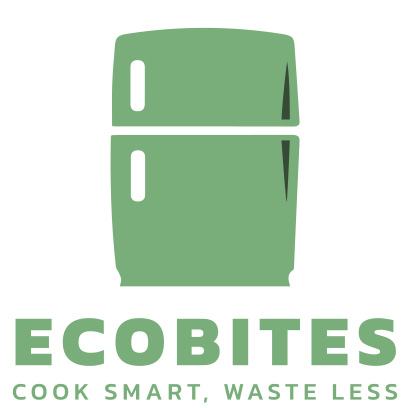

# EcoBites Web

  

  

   AI-powered recipes to reduce food waste, using what’s in your fridge, with rewards to make cooking fun and eco-friendly.
     
    <a href="https://vivi2393142.github.io/ecoBites-web">
      <strong>View Website »</strong>
    </a>
     
  

## Introduction

EcoBites is a web application developed during **BrisHack 2025** within 24 hours.

It uses AI to analyze ingredients from your fridge and recommends suitable recipes, encouraging sustainable cooking habits. Users are rewarded through a gamified system, making cooking both eco-friendly and engaging.

Note: This web app was designed primarily for mobile use, and due to time constraints, there is no desktop-responsive layout yet.

## Functions

- Smart Recipe Suggestions: AI-powered recommendations based on ingredients photo.
- Cooking Process Assistance: Step-by-step cooking guidance.
- Reward System: Users collect delicate cards as rewards.
- Seamless Mobile Experience: Optimized for mobile usability.

## How to Use

1. Scan Your Fridge & Get Recipe Suggestions:

   Snap a photo of your fridge, and AI will analyze the ingredients to suggest dishes.

   

2. Follow Recipes, Save Progress & Earn Rewards

   Cook with step-by-step instructions, add notes and photos, and earn rewards upon completion.

   

3. Reward System

   Collect ingredient cards as basic rewards and combine them to unlock advanced cuisine cards.

   

4. Discover & Track Recipes

   Get random recipe suggestions and revisit your cooking history anytime.

   

## Dependencies

- [Material UI](https://material-ui.com/getting-started/supported-components/) - React components for faster and easier web development.
- [React Router](https://reactrouter.com/) - A routing library for the React JavaScript library.
- [Jotai](https://jotai.org/) - A global React state management tool.
- [Axios](https://axios-http.com/) - Promise based HTTP client for the browser and node.js.
- [React Query](https://tanstack.com/query/latest) - Powerful asynchronous state management for TS/JS & React.

## AI Helpers

- [logo-maker](https://www.logoai.com/logo-maker) - An online AI logo generator.
- [uizard](https://app.uizard.io/) - An online AI UI generator.
- [ChatGPT](https://chatgpt.com/) - An online AI chatting robot which help us to generate pictures of "reward food cards".

## Future Development

### Optimization

- Add loading indicators & error handling
- Implement offline caching & image upload optimization
- Introduce onboarding & social sharing features

### Business Collaboration

#### Supermarket Partnership

- **Smart Recommendations**: Nearby stores, stock updates, shopping routes
- **Discounts & Memberships**: Coupons, points, promotions
- **Purchase Verification**: E-invoices, QR codes, membership integration
- **Advertising & Gamification**: Targeted ads, seasonal campaigns, reward systems

#### Ingredient & Recipe Expansion

- Seasonal & rare ingredients
- Achievement system (Chef ranks, badges, unlockables)
- Global Cuisine Map & cultural insights

### Exploration & Challenges

- **Regional Quests**: Local dishes, festivals, time-limited events
- **Rewards**: Badges, outfits, unique recipes
